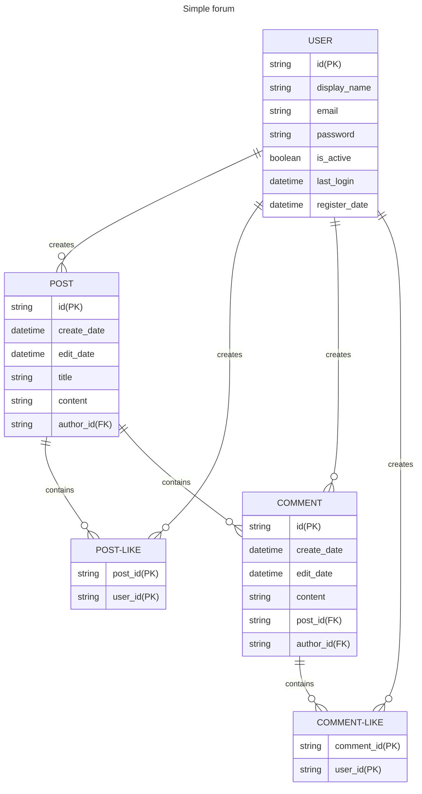

```mermaid
---
title: Simple forum
---
erDiagram
    USER{
        string id(PK)
        string display_name
        string email
        string password
        boolean is_active
        datetime last_login
        datetime register_date
    }
    USER ||--o{ POST : creates
    USER ||--o{ POST-LIKE : creates
    USER ||--o{ COMMENT : creates
    USER ||--o{ COMMENT-LIKE : creates
    POST{
        string id(PK)
        datetime create_date
        datetime edit_date
        string title
        string content
        string author_id(FK) 
    }
    POST-LIKE{
        string post_id(PK)
        string user_id(PK)
    }
    POST ||--o{ POST-LIKE : contains
    COMMENT{
        string id(PK)
        datetime create_date
        datetime edit_date
        string content
        string post_id(FK)
        string author_id(FK) 
    }
    COMMENT-LIKE{
        string comment_id(PK)
        string user_id(PK)
    }
    POST ||--o{ COMMENT : contains
    COMMENT ||--o{ COMMENT-LIKE : contains
```

